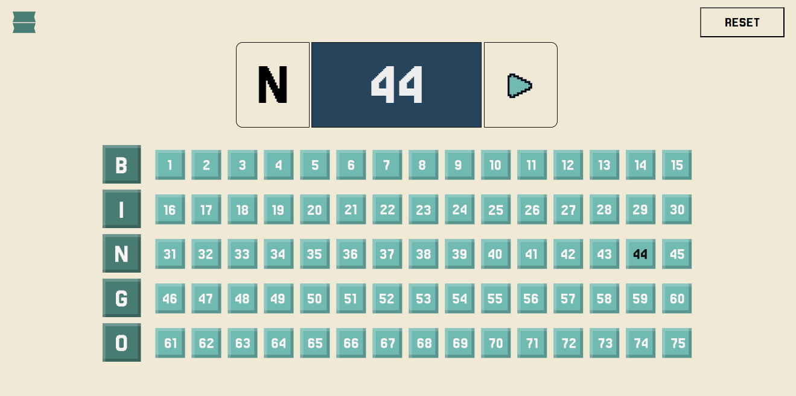

# 🎯 **Bingou**

A simple and fun Bingo game built with **Bun** for fast performance and modern web development.


## 🚀 **Setup**

### 1. Install Dependencies
Make sure you have [Bun](https://bun.sh/) installed. Then, run:
```bash
bun install
```

### 2. Start the Development Server
Launch the dev server with hot-reloading:
```bash
bun dev
```

### 3. Build for Production
Generate an optimized production build:
```bash
bun build
```

### 4. Preview the Production Build
Serve the production build locally to ensure everything works:
```bash
bun preview
```

## 📂 **Project Structure**
```
Bingou/
├── biome.json               # Biome configuration
├── bun.lock                 # Bun lockfile
├── package.json             # Project metadata and scripts
├── public/                  # Static files
│   ├── .gitkeep
│   └── playbutton.svg       # Play button icon
├── rsbuild.config.mjs       # Rsbuild configuration
└── src/                     # Source code
    ├── App.css
    ├── App.jsx              # Main app component
    ├── bingo/               # Bingo column components
    │   ├── B.jsx
    │   ├── G.jsx
    │   ├── I.jsx
    │   ├── N.jsx
    │   └── O.jsx
    ├── Bingo.jsx            # Bingo board logic
    ├── Header.css
    ├── Header.jsx           # Header component
    ├── index.css
    ├── index.jsx            # App entry point
    ├── PlayButton.jsx       # Play button component
    ├── reset.css            # CSS reset
    ├── Result.css
    └── Result.jsx           # Result display component
```

## 🎮 **Features**
- 🎲 Interactive play button to start the game
- ⚡ Powered by **Bun** for ultra-fast performance


## 💡 **Contributing**
1. Fork the repository
2. Create a new branch:
   ```bash
   git checkout -b feature/your-feature-name
   ```
3. Commit your changes:
   ```bash
   git commit -m "Add your message here"
   ```
4. Push to the branch:
   ```bash
   git push origin feature/your-feature-name
   ```
5. Open a pull request


## 📜 **License**
This project is licensed under the [MIT License](./LICENSE).


## 🌟 **Acknowledgments**
- Built with ❤️ using [Bun](https://bun.sh/)
- Inspired by the classic game of **Bingo**
